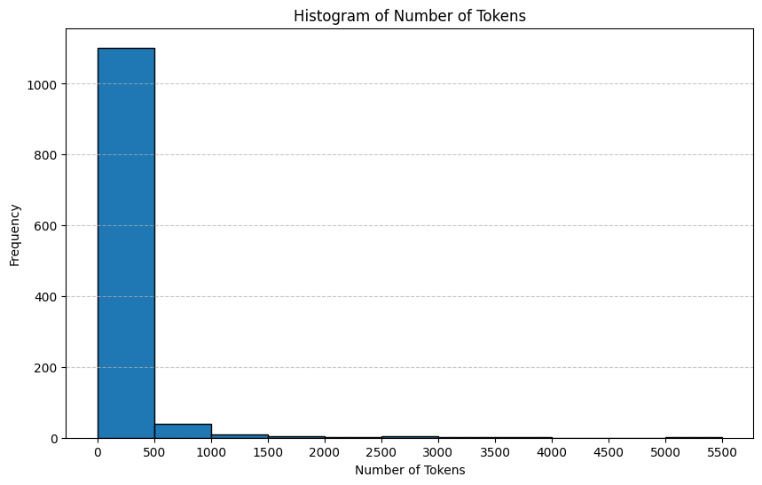

# Eurostar demo
Build a chatbot powered by LlamaIndex that augments GPT 3.5 with the contents of the Streamlit docs (or your own data).

## Pre-processing
- Excel document converted to html files
- Removed all files with titles starting "ILOYAL*", "PSP*", "INC*", "EURO*", "SBE*" as they were not relevant to a customer-facing knowledge base
- Calculated the number of tokens for the messages and got the following distribution
```markdown

```
```markdown

```

### Chunking
Instead of trying to implement a complicated chunking strategy (e.g. splitting by every paragraph), given the distribution of the number of tokens in each of the files (95%+ is less than 1000 tokens), a sensible approach would be:
- Chunk data at 1000 tokens with an overlap of 200.
- 
## Demo App

[](https://llamaindex-chat-with-docs.streamlit.app/)


## Try out the app

Once the app is loaded, enter your question about the Streamlit library and wait for a response.
