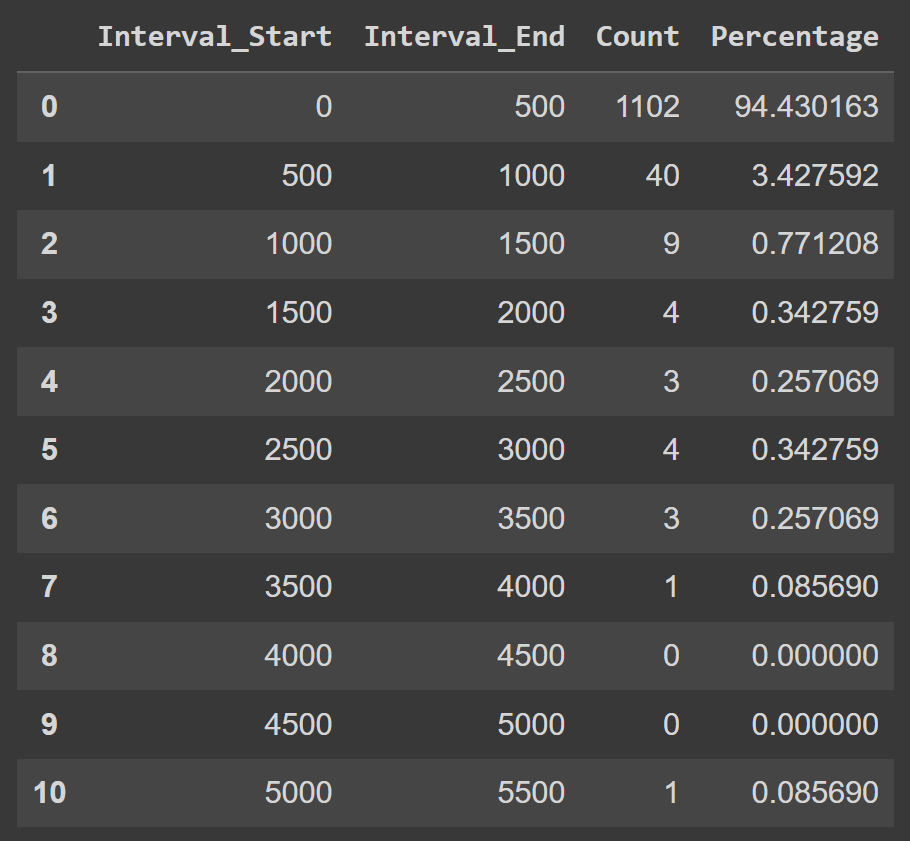

# Eurostar demo
https://eurostar.streamlit.app/

Once the app is loaded, enter your question about Eurostar and wait for a response.

## Pre-processing
- Excel document converted to html files
- Removed all files with titles starting "ILOYAL*", "PSP*", "INC*", "EURO*", "SBE*" as they were not relevant to a customer-facing knowledge base
- Calculated the number of tokens for the messages and got the following distribution

### Chunking
Instead of trying to implement a complicated chunking strategy (e.g. splitting by every logical section / paragraph), given the distribution of the number of tokens in each of the files (95%+ is less than 1000 tokens), a sensible approach would be:
- Chunk data at 1000 tokens with an overlap of 200.
- Chunk data at 6000 tokens. Many embedding models have a context length of 8192 so viable.

### Embeddings
Important to check on MTEB (Massive Text Embedding Benchmark) to determine which embeddings models are performant.

### Reranking
Used a re-ranker to improve on the retrieval step.

## Results of unit testing
https://docs.google.com/spreadsheets/d/1UQ3cscKfnj9avwbkEuib7aXN5C7Y8gbDuYo3H_mDa2Q/edit?usp=sharing

## Future development
- Query processing
    - Checks to see if there is any PII or content that violates policy
    - Caching of previous FAQ
- Post-retrieval
    - Rerankers to improve on results
- Post-completion
    - Policy check
    - Fact checking

- Hybrid search
- Don't display source links if the questions are irrelevant
